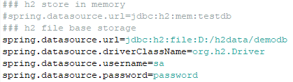
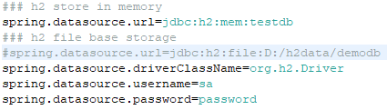
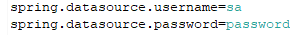
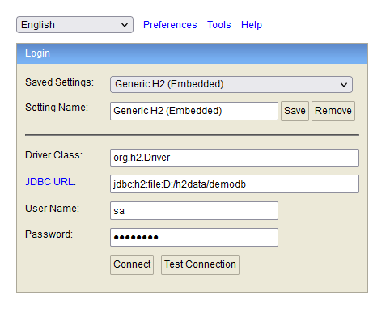
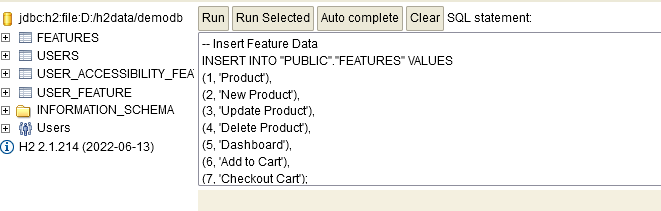
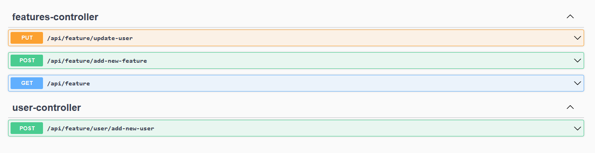

# app-features-backend
This is simple Spring Boot project where employing Model View Controller (Spring MVC) design pattern. 
<br />
Also employing JpaRepository extension which is contains API for CRUD (Create, Read, Update and Delete) operations and also API for pagination and sorting.

The main objective this application is to allow user to manage users’ accesses to new features via feature switches,
i.e. enabling/disabling certain feature based on a user’s email and feature names).  

## Tools & Framework used for this project
1. Java 17 (or latest)
2. Maven
3. Spring Boot 3 (3.0.6)
4. H2 Database
5. OpenApi 2 (Swagger-Ui)

Please ensure to checkout the source code and import as maven project before proceed to next step.

## Step by step to configure the H2 database
1. By default the server will run on port **8080**. To change it you can simply open the **..\resources\application.properties** file and change the value at this **_server.port=8080_** property.
2. By default the H2 database been set to use file based memory (**Recommended**). As per on below image.
<br /><br />  <br /><br />
3. To change the H2 in-memory database (**Notes, all the data will be missing after application close**), simply change the property value as per on below image.
<br /><br />  <br /><br />
4. To change the h2 database username and password please change the property value as per on below image.
<br /><br />  <br /><br />

## Step by step to configure and run the application
1. Please checkout the source code and import as maven project.
2. Find the **org.springframework.boot.SpringApplication** class and run the application.
3. Insert the dummy data that had been provided at **..\resources\script_db\00.00.01\data.sql**.
4. To insert the data please open the link http://localhost:8080/h2-console and login (To find the usernmae and password, please take a look into **application.properties** file).
<br /><br />  <br /><br />
5. Please copy and paste the query. And run the query.
<br /><br />  <br /><br />
6. To ensure the users and features tables was successfully loaded the data, simply run on below query

```js
SELECT * FROM USERS;
```
```js
SELECT * FROM FEATURES;
```

## Testing API using OpenApi
1. The application already integrated with the OpenApi. To test it simply open the link http://localhost:8080/swagger-ui/index.html
<br /><br />  <br /><br />
2. Choose any one of the availble API. And fill-in any necessary information that needed. After that click Execute to run the API.
<br /><br />  <br /><br />

## Table definition
